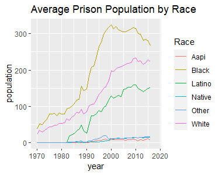
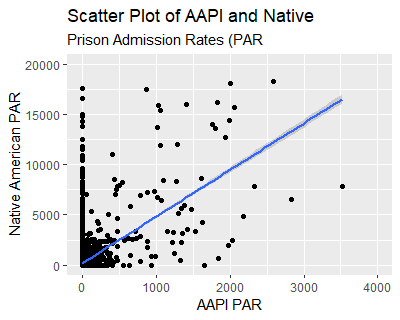
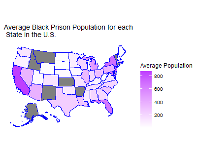

---
output:
  pdf_document: default
  html_document: default
---
# Observing American Prison Populations for each Race

### Introduction

I will be analyzing the relationship between race and prison population in the United States. The races categorized are AAPI (Asian American Pacific Islander), Black, Latino, Native American, White, and Other. From these specific categories, the variables I will be analyzing are the prison population and prison admission rates for each race. Doing so allows me to measure the racial makeup of American prisons to identify racial bias. I will present three different visual charts that observe the average prison population for each race between the years 1970-2018, comparing the prison admission rates of AAPIs and Native Americans, and the geographic distribution of the average black prison population throughout the U.S.

Additional information about the dataset: incarceration data was collected by the Vera Institute. The dataset obserserved the population count and admission rates to prison across all 50 states over the past decades. Specific details about the races are also recorded. More information and the domain about racial inequality in the U.S. prison system can be found here: (https://github.com/vera-institute/incarceration-trends#documentation)

### Summary Information

Here I have provided relevant values of interest about prison population by race:

What is the average Latino prison admission rate in Washington state? 322.0187

What is the difference between the highest black male and black female prison population? Male: 23465. Female: 1774. Difference: 21691

What is the Average Asian prison population rate across the United States? 34.71696

What is the White median prison population? 61

What is the number of unique counties? 1876

What is the highest total prison population in the Southern region? 31150

What is the highest total prison population in the Northeastern region? 47409

### Trend over time chart

The chart created is a multi-line plot of the average prison population for each race from the years 1970-2018. The line plot allows for easy visualization for trends within a race as well as comparisons with other races. For example, one pattern that emerges is that across all races there is a positive growth, meaning over the years the average prison population is increasing. The top three highest average prison populations are Black, White, and Latino respectively which are all marginally higher than AAPI, Native American, and Other. Around the year 2000, the average Black prison population was the highest, of about 320, across all races.

### Variable comparison chart

The chart created is a scatter plot between the prison admission rates of AAPIs and Native Americans. These two variables are continuous and scatter plots are a great indicator of finding any correlation between them. The chart shows a positive correlation, meaning that as the AAPI prison admission rate increases so does for Native Americans. Most of the cluster of points are relatively low and there are more instances where prisons that admit Native Americans actually have a zero admission rate for AAPI. The linear curve shows that approximately for every prison that has an admission rate of 1000 AAPIs, that same prison has an admission rate of 5000 Native Americans.

### Map

The chart created is a U.S. map that shows the geographic distribution of the Black prison population on average for each state. This visual map shows geographic familiarity for American viewers who can quickly identify Black prison populations by region. The U.S. map also includes a color scale that shows as the shade gets darker, the higher the state average is for Black prison population. States that are gray filled have no observational data in the dataset. According to the map, we can see that among the darkest shaded regions are California, New York, New Jersey, and Florida.

